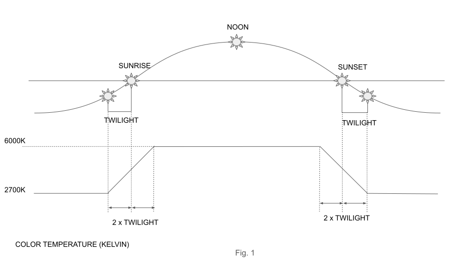

# homework-back-end
Technical interview homework assignment for back-end developers

# NightTimeTemperature Microservice

Implement NightTimeTemperature microservice, which determines colour temperature of the screen according to current position of the sun. Calculate temperature in Kelvins according to Fig. 1

Implement a GET request with the following parameters:
- lat (float): Latitude in decimal degrees. Required.
- lng (float): Longitude in decimal degrees. Required.

## Sample request
localhost:8080/night-time-temperature?lat=43.66258321585993&lng=-79.39152689466948

## Response 
{
	“temperature”:3400
}

## Implementation
- Use https://start.spring.io/ to create Gradle Project for Java or Kotlin;
- Use https://sunrise-sunset.org/api for determining sunrise/sunset/twilight;
- Create Dockerfile to run microservice as a Docker container;
- Add JUnit **integration** tests to verify correctness of service execution (test should be executed using Gradle integrationTest task, see https://docs.gradle.org/current/userguide/java_testing.html#sec:configuring_java_integration_tests);
- Create Service Virtualisation to mock sunrise-sunset.org API using [WireMock](http://wiremock.org/);
- WireMock should run as a Docker container as well - use https://hub.docker.com/r/rodolpheche/wiremock/;
- Provide two Spring Boot profiles - dev and qa. Dev profile should use WireMock and qa profile should use real sunrise-sunset.org service;
- Use docker-compose to define and run NightTimeTemperature service and WireMock containers together;

Please provide instructions on how to build, run, and execute integration tests in the following section.

## Technology Used
- Docker  - Docker version 20.10.5, build 55c4c88
- Docker-Compose - docker-compose version 1.29.0, build 07737305
- Gradle - Gradle 6.8.3

## Execution Instructions

 - Build Project: `gradle -PbuildProfile=dev build -x test && gradle -PbuildProfile=qa build -x test`
 - Use Shell Scripts for build project: `./build.sh`
 - Run Docker Container: `docker-compose up -d` or `./start.sh`
 - Access DEV container (With WIremock): http://localhost:9010/night-time-temperature
 - Access QA container (Without WIremock): http://localhost:9020//night-time-temperature?lat=43.66258321585993&lng=-79.39152689466948
 - Execute test: `gradle -PbuildProfile=dev build && gradle -PbuildProfile=qa build` or `./gererate_test_results.sh`
 - Test result path: `\build\reports\tests`